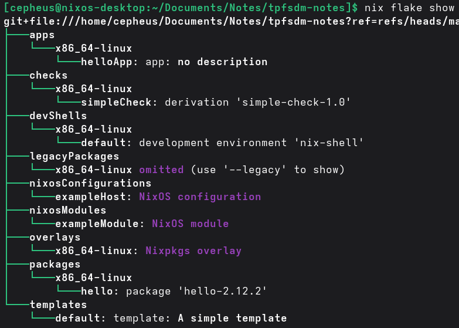

# Flakes
Flakes are flagged as an experimental feature of nix, even though they are widely adopted and well tested.

Simply put, flakes are attribute sets with the following 3 fields; `description`, `inputs` and `outputs`. What makes flakes useful is the standardized structure of `inputs` and `outputs` that are utilized in special ways by various nix commands. For example, inputs can contain other flakes.

A common use case for this is accessing nixpkgs, the software repository containing over 100'000 packages with nix expressions for building them. Simply specifying nixpkgs.url = \[github url to nixpkgs\]; in a flakes inputs will make nixpkgs(i.e.: the _flake_ defined at the top level of the nixpkgs repo) accessible and usable in defining outputs in the current flake. nixpkgs has a ton of outputs, one of which is legacyPackages. This is one of the standardized flake outputs. Because we include `nixpkgs.url = "github:NixOS/nixpkgs/nixos-unstable";` in the `inputs` field of our flake, we can access `nixpkgs.legacyPackages.x86_64-linux.vscode` in defining our outputs. We could use it as part of a `nixosConfigurations` output in out flake. Similarly we could use `nixpkgs.legacyPackages.x86_64-linux.buildRustPackage` to build a rust package that we ourselves expose under `packages` in our flake.

So, as stated, flakes are simply a standardized way of specifying inputs(other flakes) and outputs(typically [derivations]([[20251016165533]]) of some kind) under [standard output names](https://nixos-and-flakes.thiscute.world/other-usage-of-flakes/outputs).

## A simple example
```nix
{
  description = "Simple flake exposing GNU hello";

  inputs = {
    nixpkgs.url = "github:NixOS/nixpkgs/nixos-unstable";
  };

  outputs = { self, nixpkgs }: {
    packages.x86_64-linux.hello = nixpkgs.legacyPackages.x86_64-linux.hello;

    defaultPackage.x86_64-linux = self.packages.x86_64-linux.hello;
  };
}
```
In the above example, nixpkgs is the only input. It contains an attribute legacyPackages. nixpkgs.legacyPackages.x86_64-linux is a derivation that builds a simple hello world program for x86 linux. If we run `nix build .` in the directory with the flake, hello will be either fetched from a binary cache, or built to specification, and placed in /nix/store, where it's "ready to be used on the machine".

## But ... why??????
The reason we use flakes is to lock the exact version of inputs. It's the same reason that we might want to specify an exact commit of the source of some software we want to build with nix; to ensure reproducibility. When we run something in the flake, a `flake.lock` file is generated. Much like a `cargo.lock` or `package-lock.json` it pinpoints the exact versions of inputs. Not only down to the commit ID, but by hashing the contents of the inputs. So in effect, we achieve mostly the same effect as we could by using fetchUrl with some exact commit ID(no flake) and a sha256 checksum. However, flakes is a cleaner way to manage this. We can have a list of inputs in a standardized format, and have the ability to automatically update some or all of those inputs at will.

Another perk of flakes is the standardized outputs, which other flakes may interface with. We can import some flake, and we will find packages under `packages`, and so on. We can use `nix flake show` to display a tree of the available derivations of a flake, including what systems they're available for:


## Fields of a flake
Flakes have specific allowed fields that are used for different things, often accessed by different `nix` commands.

### Description
It's really just a description.

### Inputs
A flake can take other flakes as input. Technically inputs can be something other than a flake, like a tarball or local files, but this never happens(there are other ways to take input in derivations and similar without putting them in the flake inputs).

### Outputs
The following is an exhaustive list of all outputs a flake may specify:
- [packages]([[]]) \[TBA\]
- [devShells]([[]]) \[TBA\]
- [nixosModules]([[]]) \[TBA\]
- [nixosConfigurations]([[]]) \[TBA\]
- [apps]([[]]) \[TBA\]
- [checks]([[]]) \[TBA\]
- [overlays]([[]]) \[TBA\]
- [hydraJobs]([[]]) \[TBA\]
- [templates]([[]]) \[TBA\]
- [formatter]([[]]) \[TBA\]
- [legacyPackages]([[]]) \[TBA\]

**Clarification**: _It's not actually the case that the above explains all possible inputs and outputs. A flake can contain all sorts of fields, top-level and not. The above, however are the standardized fields accessed by nix commands and subject to certain requirements in order to be valid and function with nix, nixos and other flakes._